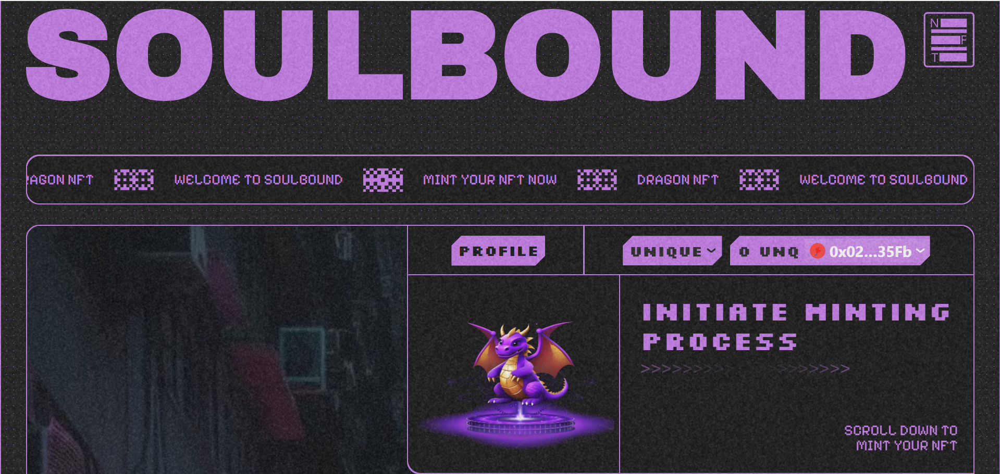

# Add Discord Id

    ### Function to Add Discord Id for Contributors in the Community

    **Overview:**
    This function is designed to store discord id in the blockchain corresponding to their wallet

    - First, you go to **connect wallet** and click on the **Profile** button

    

    - Your Profile page will have the following interface:

    

    - You will click on the **Options** button:

    

    - You press the **ADD ID DISCORD** button and the interface is as follows:

    

    - You press the **Login with Discord** button and chill:

    

    - You authorize your discord and the website will automatically process and bring you to the following page:

    

    - Then you **Confirm** and you are on the list of our first testers

    

    - If the website does not reload the page, please reload the page and you will see your Discord ID as follows:

    

    **Video Demo:**
    ### <iframe width="560" height="315" src="https://www.youtube.com/embed/Bwa_NKlPy8Y" frameBorder="0" allowFullScreen></iframe>
