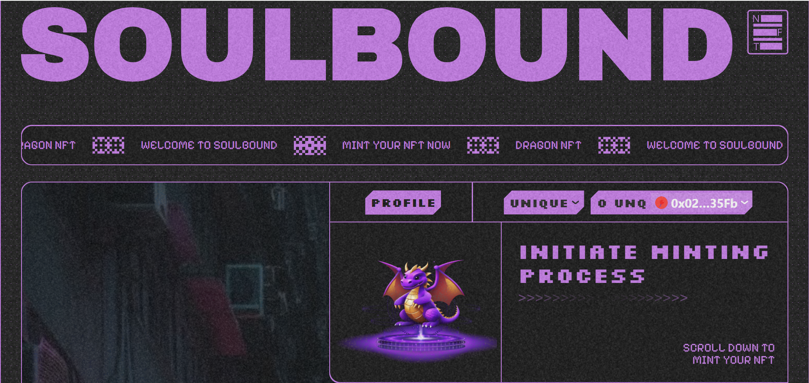
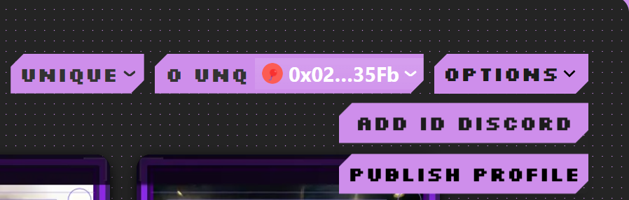
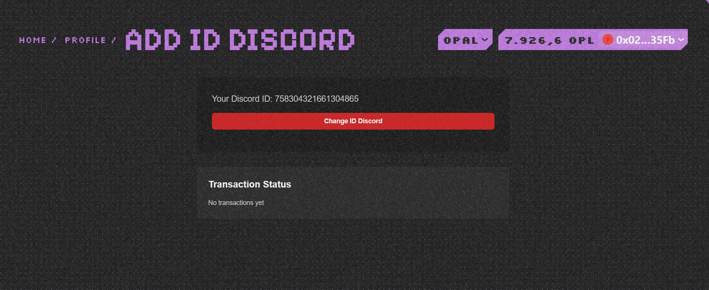
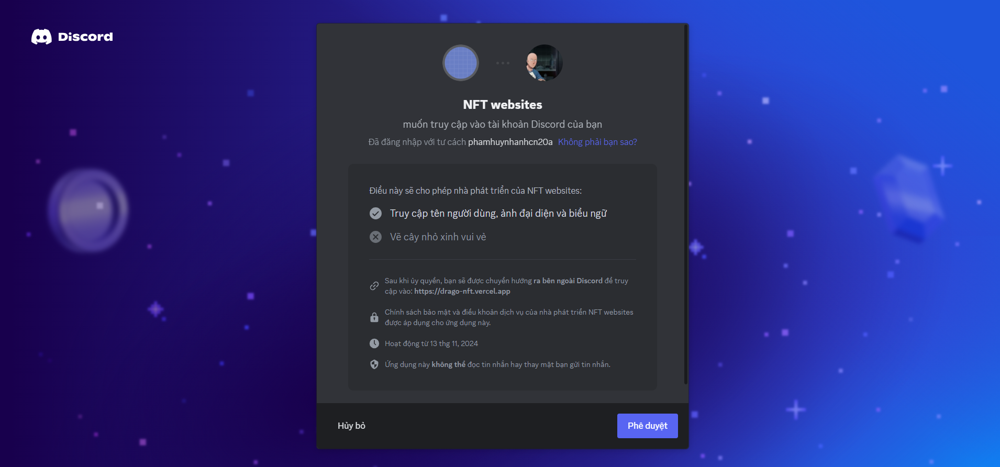
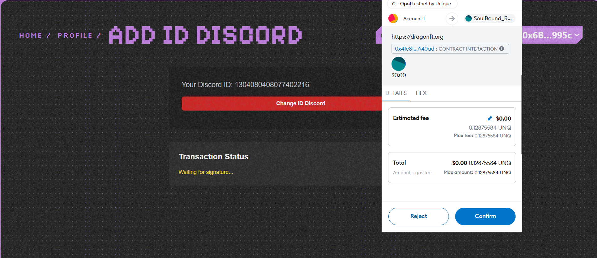

# Change Discord Id

    ### Function to Change Discord Id for Contributors in the Community

    **Overview:**
    This function changes the discord id in the blockchain corresponding to their wallet

    - First, you go to **connect wallet** and click on the **Profile** button

    

    - Your Profile page will have the following interface:

    

    - You will click on the **Options** button:

    

    - You press the **ADD ID DISCORD** button and the interface is as follows:

    

    - You press the **Change ID Discord** button and authorize your information

    

    - You will have to **Confirm** this transaction to change your discord id:

    

    - Then you will see your changed information when you reload the web page.
