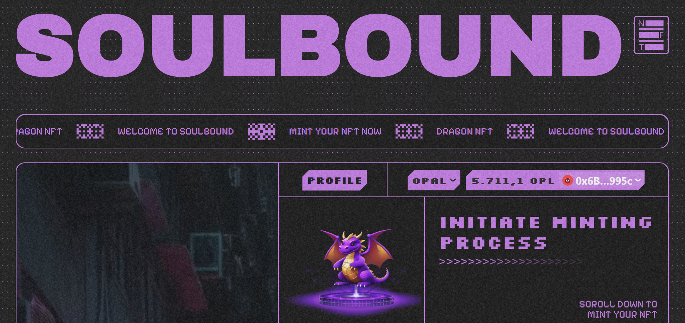
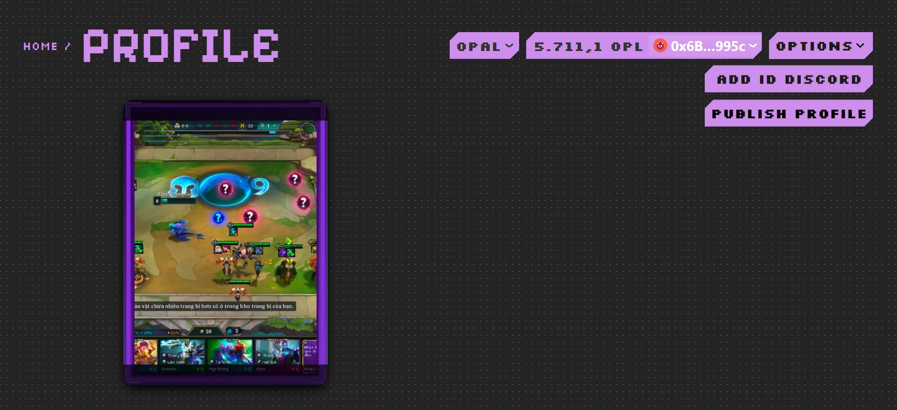
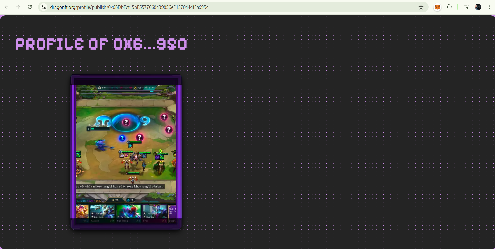

# Profile Builder

### Function to Display Builder's Profile

**Overview:**
This function displays a personal profile page containing NFTs they have collected within communities, and the website can stand alone without requiring users to connect their wallet to view.

    - First, you go to the **Profile** page

    

    - Then you click on the **Publish Profile** button

    

    - Then you have your profile page and can share it with friends!

    