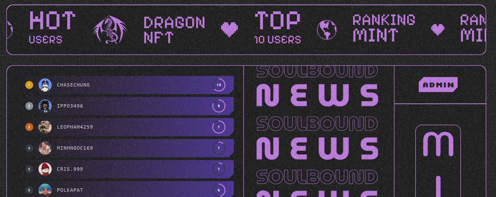
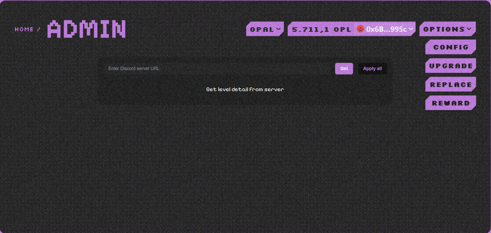
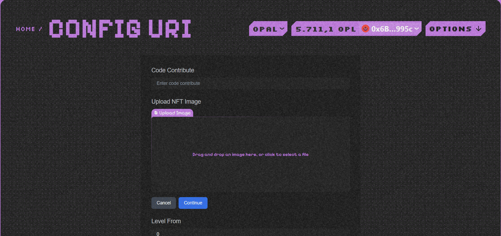
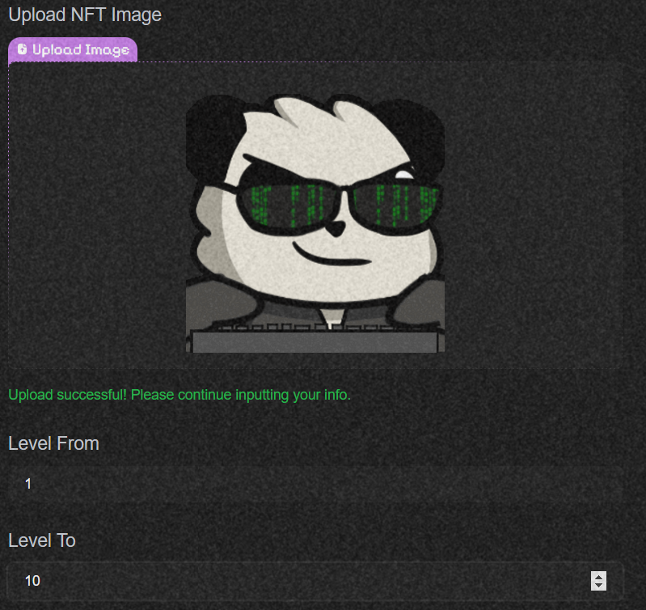
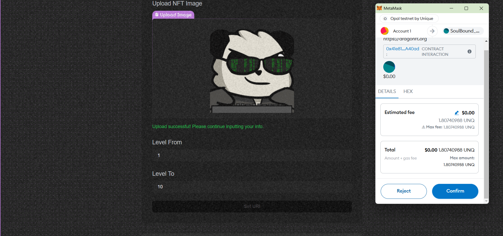
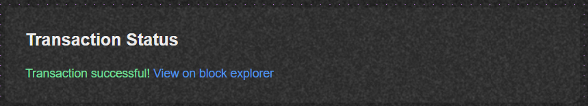
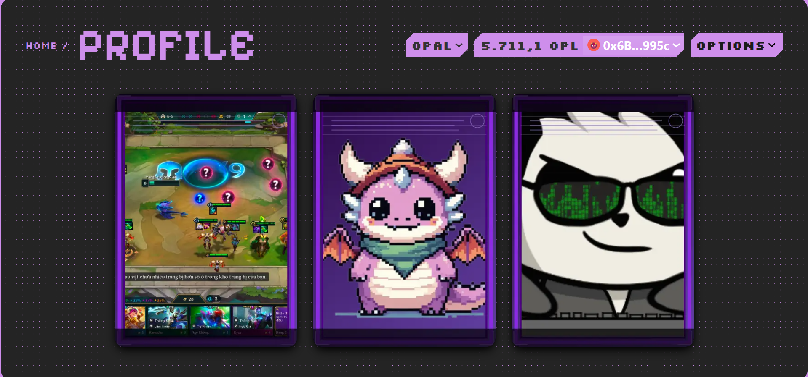

# Config

### Function to configure URI with each Level and Code Contribute

**Overview:**
With each Code Contribute and Level, community managers will be able to easily create and manage URIs according to the level of the NFTs they mint.

    - First, you need to scroll down to the **Admin** section!
    
    

    - You select the **Config** button! :

    

    - You will see the interface of **Config URI** :

    

    - You enter the *Code Contribute* code of your community!

    

    - Then you upload the images to replace and the corresponding levels!

    

    - And now you press the **Set URI** button!

    

    - And after **Confirm**, you have set the URI for each level in your community!

    

    - Now you check the **Profile** page and can see that your OG NFT has been changed!

    