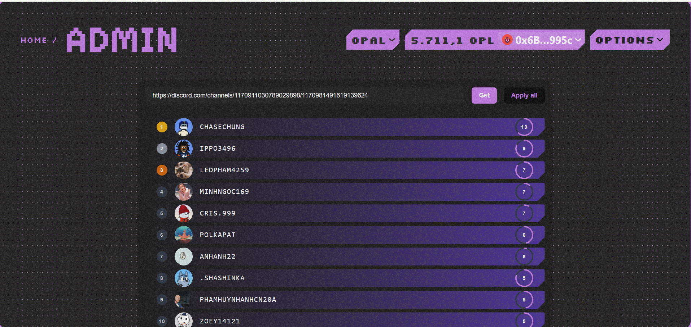

# Get & Mint for All

### Function Get & Mint for All for Contributors in the Community

**Overview:**
This function requires a url link to the community's Discord server to directly retrieve detailed information about their rank, avatar, name and level in order to Mint for all members in the community. Currently, we are supporting communities with Discord Servers using the mee6 bot.

    - First, you need to make sure to go to the **Admin** page!

    

    - We enter the url of the Discord Server and click the **Get** button!

    

    - After making sure this is your community.

    - We click the **Apply all** button and the website will look like this:

    

    - Now you upload the OG NFT and other information to match your community!

    

    - You enter the Discord Server link in this box and press **Enter**!

    

    - After pressing **Enter**, you will see a list of Discord IDs in your community:

    

    - Now you press the **Mint SoulBound NFT** button to mint all Discord IDs linked to their wallet address with their OG NFT!

    

    - Press the **Confirm** button and everything is done.

    