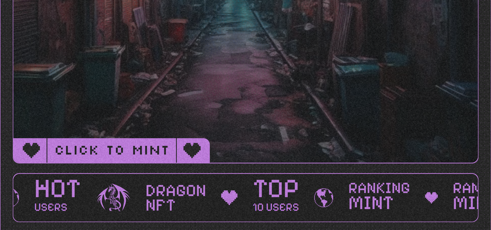

# Mint Certificate NFT

### Mint Certificate NFT Function

**Overview:**
This function provides a type of NFT as a Certificate for the contributors themselves, provided by the community manager.

    - First, you need to scroll down and find the **CLICK TO MINT** button on the main page of dragonft.org

    

    - Ensure you are on this page:

    

    - Now you are on the page to mint Certificate NFT, if you want to be more certain, you can click the **MINT CERTIFICATE NFT** button again

    - Next, follow the steps in the form below to mint your NFTs!

    

    - Upload your NFT Certificate!

    

    - Click the **Continue** button and you will successfully upload the image!

    

    - Cool! Now you have successfully uploaded the image!

    

    - But wait, we still have a few more steps to mint the NFT Certificate!
    - You fill in the **Code Contribute** and **Recipient Wallet Address** in the forms below!

    

    - Note:
        - **Code Contribute**: The Contribute code of the community set by you as the Admin for each contribution in your community.
        - **Recipient Wallet Address**: The wallet address to which you will mint this NFT Certificate.

    

    - Then press the **Mint Certificate NFT** button to mint the NFT Certificate to the wallet address you want!

    

    - Thus, we have minted the NFT Certificate to the wallet address you want!

    

    - You can check the wallet address that has minted the NFT Certificate on this **Profile** page!

    