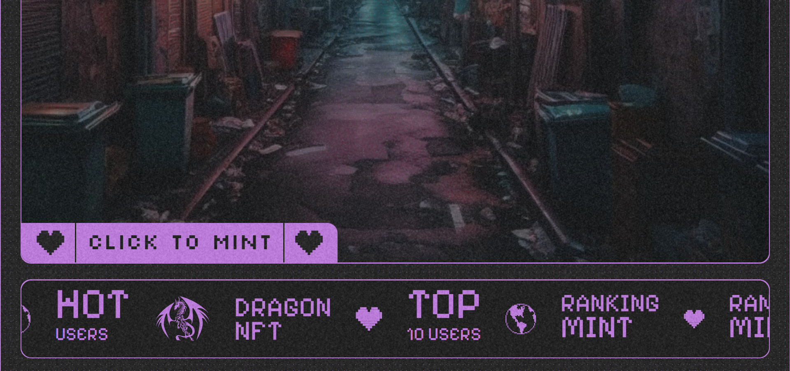
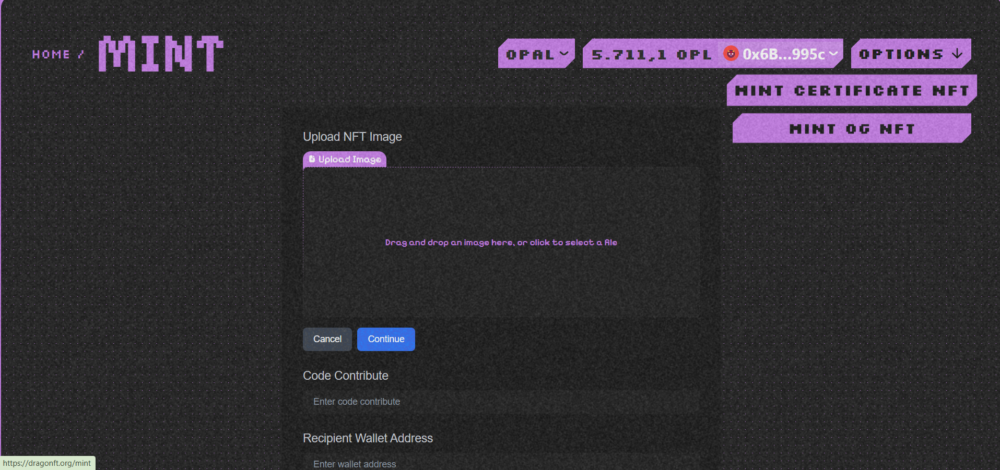
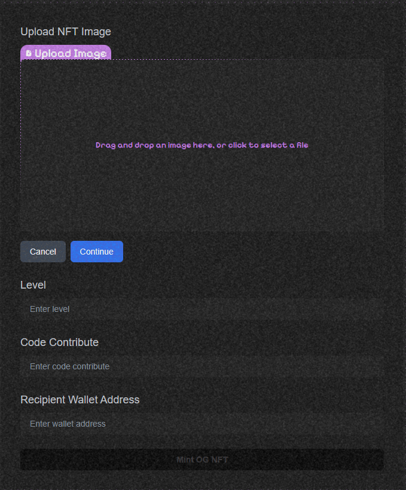
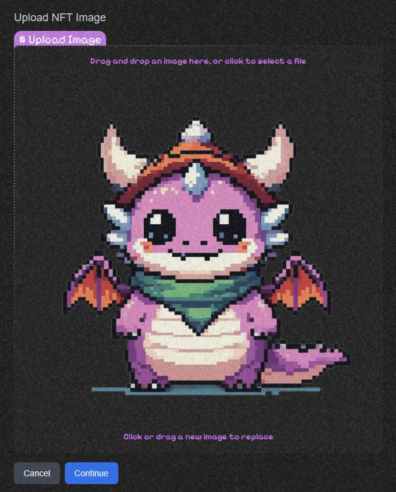
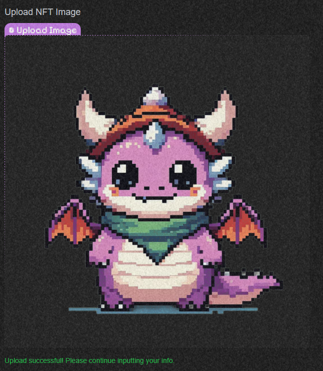
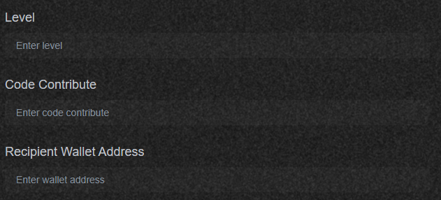
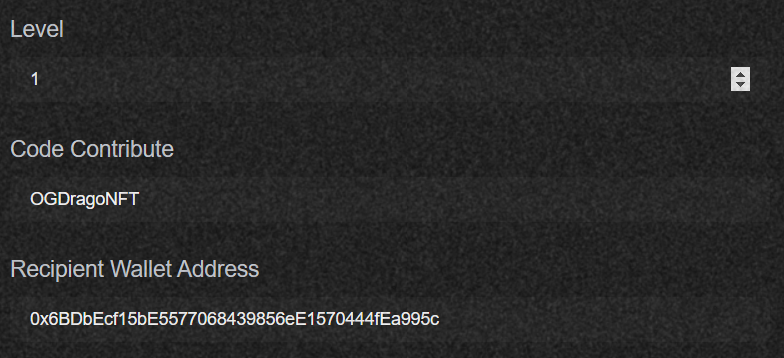
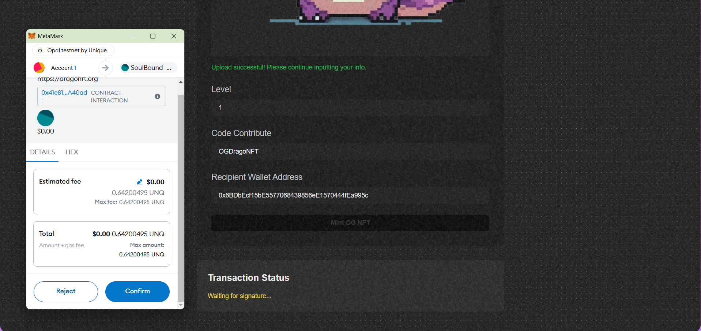
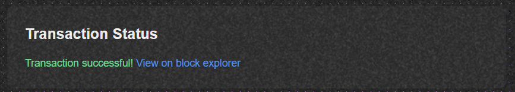

# Mint OG NFT

### Mint OG NFT Function

**Overview:**
The Mint OG NFT function is a function that mints a type of Dynamic NFT that can change its URI based on level, and in the future, possibly even Rank and animations of the NFT can also be automatically changed if the user reaches a level threshold designed by the community manager.

    - First, you go to the main page and click on the **CLICK TO MINT** button!

    

    - Then you choose **MINT OG NFT**, this choice will help you switch to the page used to mint NFT for the community and this NFT can change its level!

    

    - After entering this page, you will start filling in the following information in order from top to bottom!

    

    - You upload the image and press the **Continue** button!

    

    - That's it, you've succeeded!

    

    - Next, you fill in the following information!

    

    - Note:
        - **Level** : This is the level of the member in your community
        - **Code Contribute* : This is the contribute code that you set for members, this code will be used in the reward mechanism for members in the community!
        - **Recipient Wallet Address** : This is the wallet address where you want to mint OG NFT for your member!
    
    

    - Then you mint OG NFT for the user!

    

    - After successfully minting, you will be notified as follows:

    

    - And now you can check it on the **Profile** page!