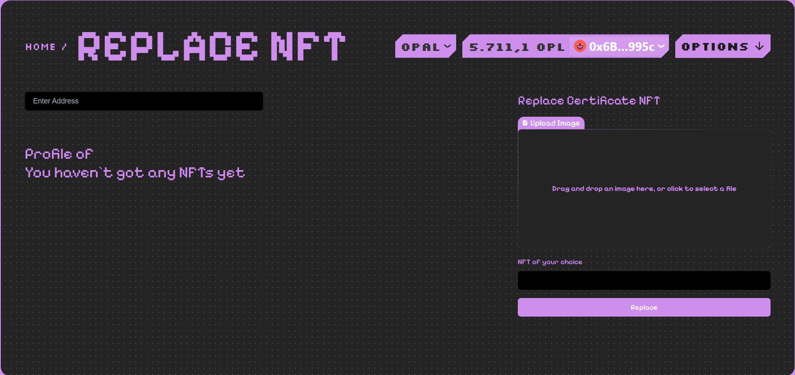
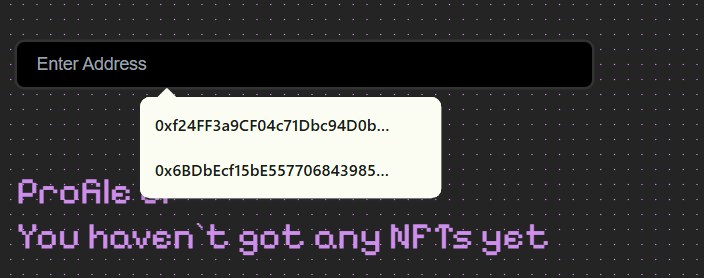
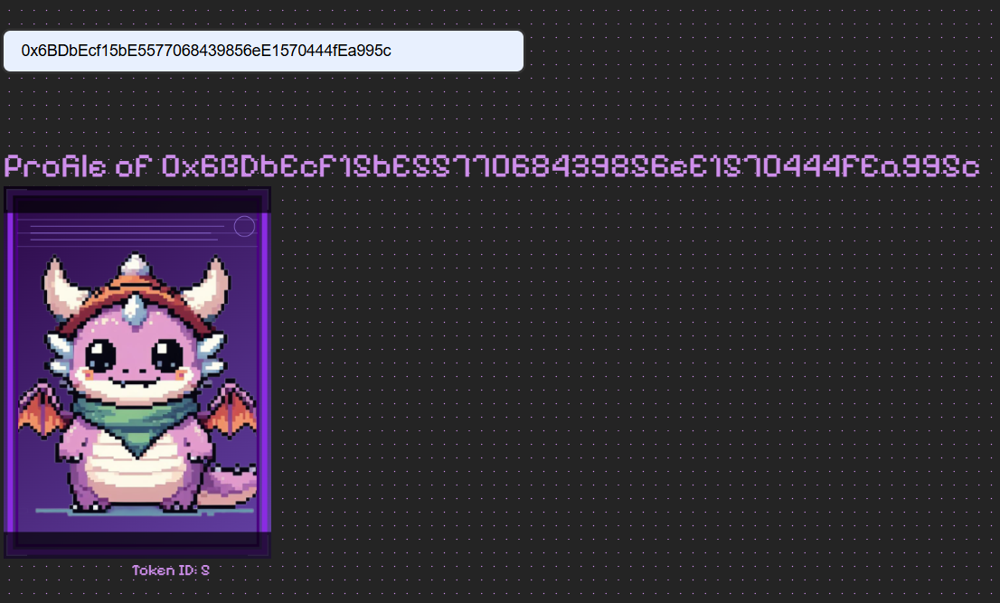
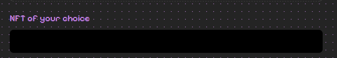
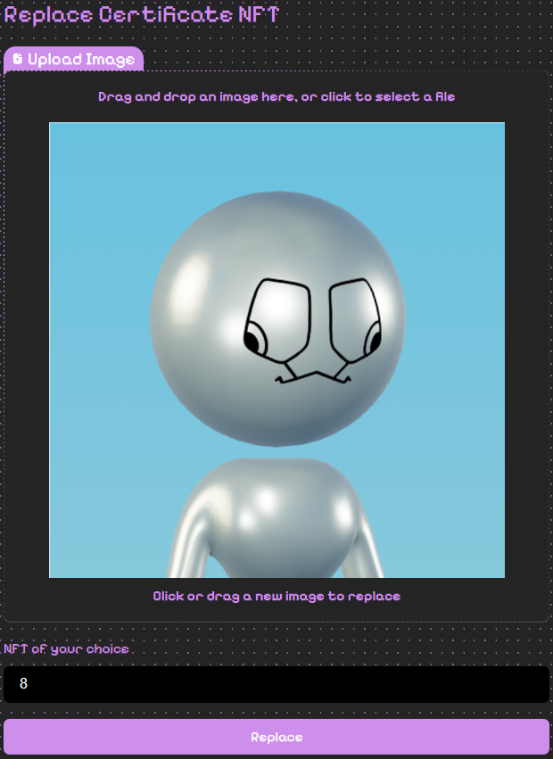

# Replace

### NFT URI Replace Function

**Overview:**
This function aims to provide a solution for replacing URLs and non-essential information that have errors during the NFT minting process for community managers.

    -   First, you need to ensure you are in the **Admin** section of the website!

    

    - You press the **Replace** button!

    

    - You will see the following interface:

    

    - Enter the wallet address for which you minted NFTs, and start replacing their images (note that only NFT Certificates can be replaced!)

    

    - After pressing **Enter**, we will find the NFT Certificates of that wallet address and start replacing them!

    

    - Please note the Token ID of the displayed NFTs and you will enter the Token IDs of the NFTs you want into this box!

    

    - Then we upload the image and click the **Replace** button!

    

    - And now we can check if we have replaced the NFT Certificate!
