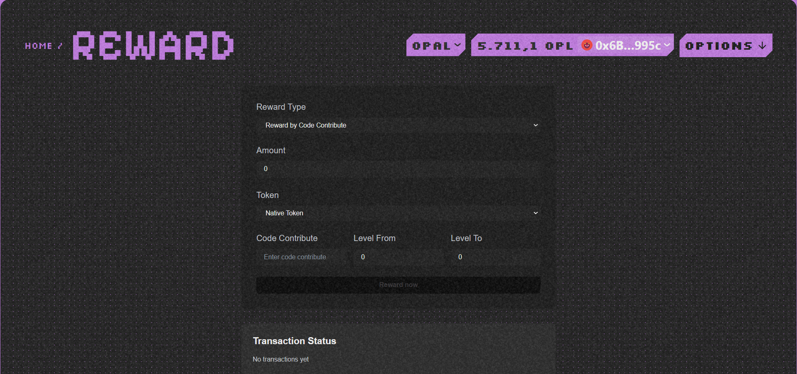
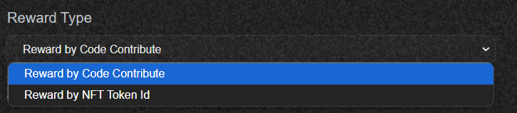
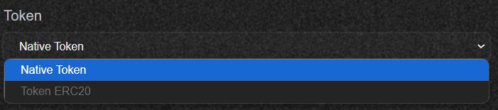
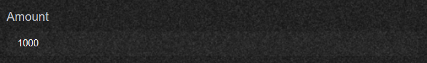
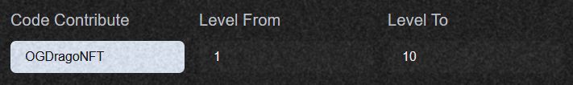
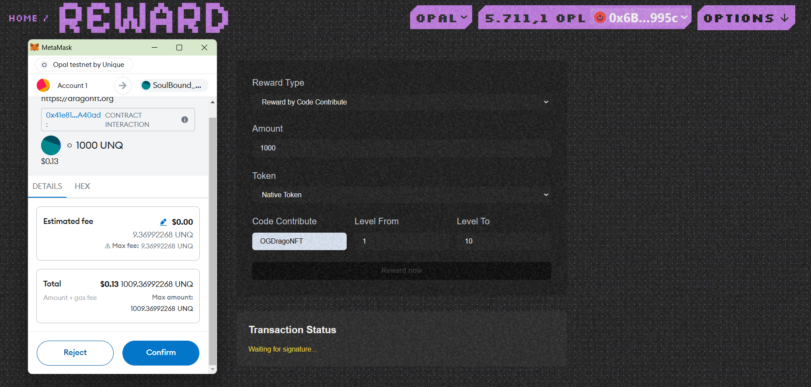
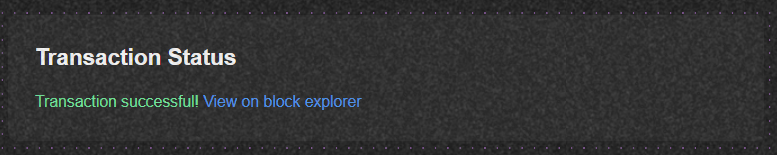

# Reward

### Reward Function for NFT

**Overview:**
This function is divided into 2 types, one type will reward based on CodeContribute and the corresponding Level of community members, the other type will reward based on the wallet address desired by the community manager.
Currently, the platform is developing for Native Token and in the future, it may be applicable to ERC 20 Token and stable coins.

    -   First, you need to ensure you are in the **Admin** section of the website!

    

    - You press the **Reward** button!

    

    - The interface of the **Reward** page is as follows:

    

    - You can choose to reward based on Code Contribute or NFT ID!

    

    - Currently, the platform is only open to rewarding with native tokens on the Unique Network

    

    - You enter the number of tokens you want to reward to your members!

    

    - You enter the **Code Contribute** code and the level that meets the standard to receive the reward!

    

    - And now we press the **Reward now** button!

    

    - Now your community members have received it!

    