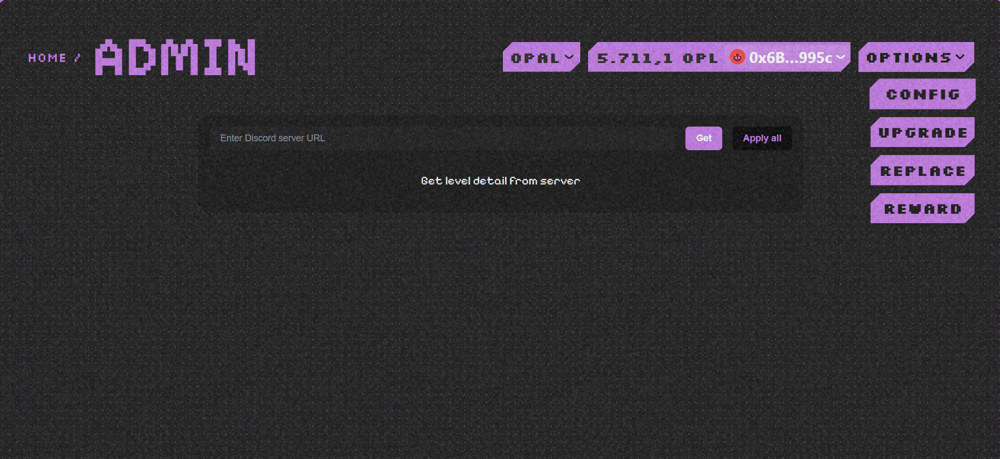
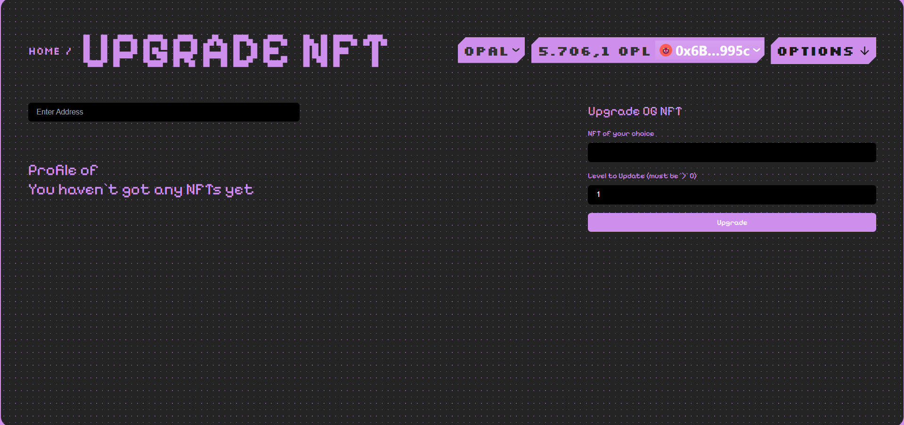
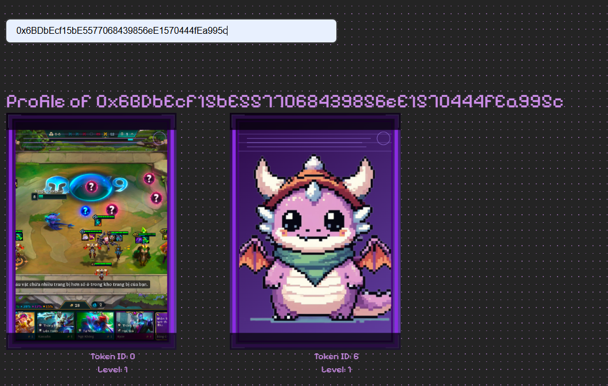
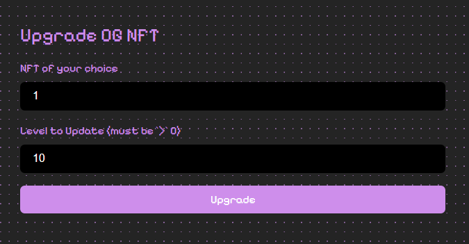

# Upgrade

### Upgrade Function for OG NFT

**Overview:**
This function aims to bring the ability to update OG NFTs (Dynamic NFTs) for community managers. A small note is that only those who create NFTs for Members can update the level for those NFTs.

    -   First, you need to ensure you are in the **Admin** section of the website!

    

    - You press the **Upgrade** button!

    

    - You will see the following interface:

    

    - Now you enter the wallet address that needs to upgrade the level of the OG NFT:

    

    - You select the level to upgrade for this OG NFT:

    

    - Then press the **Upgrade** button!